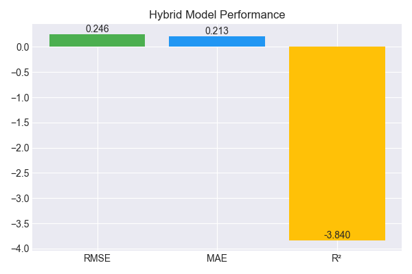

🌾 Hybrid Precision Farming & Crop Health Forecasting System.
📘 Overview

The Hybrid Precision Farming & Crop Health Forecasting System is an intelligent machine learning solution designed to predict crop yield performance based on multi-source agricultural data — including rainfall, temperature, and pesticide usage.

This system uses a hybrid optimization algorithm combining AIS (Artificial Immune System) and GA (Genetic Algorithm) to automatically fine-tune neural network hyperparameters, providing higher accuracy, faster convergence, and improved generalization compared to standard models.

It generates:

🔢 Optimized yield predictions

📊 Detailed result metrics (RMSE, MAE, R²)

🖼️ Visualization graphs for insights

💾 Saved artifacts for reuse and deployment

🚀 Key Features
Feature	Description
⚙️ Hybrid Optimization (AIS + GA)	Dynamically tunes neural network hyperparameters (neurons, learning rate, dropout) for best performance
🌦️ Multi-Source Data Fusion	Combines rainfall, temperature, and pesticide datasets aggregated by year
🧠 Deep Learning Model	Uses a fully connected neural network optimized for regression tasks
📈 Visualization Suite	Generates Accuracy, Heatmap, Comparison, Prediction, and Result graphs
💾 Persistent Artifacts	Saves model (.h5), scalers (.pkl), config (.yaml), results (.json, .csv)
📊 Smart Prediction Engine	Predicts future yields from any new dataset (like yield.csv) and auto-aligns features
🗂️ Project Structure
Precision Farming & Crop Health Forecasting System/
│
├── archive/
│   ├── pesticides.csv
│   ├── rainfall.csv
│   ├── temp.csv
│   └── yield.csv
│
├── hybrid_precision_farming_ais_ga.py          # Hybrid AIS+GA training script
├── hybrid_precision_predict_final.py           # Prediction + result generation script
│
├── hybrid_precision_model.h5                   # Trained deep learning model
├── hybrid_scaler_x.pkl                         # Input feature scaler
├── hybrid_scaler_y.pkl                         # Output target scaler
├── config.yaml                                 # Saved model configuration (feature list, parameters)
│
├── hybrid_precision_results.csv                # CSV with predicted yields
├── hybrid_precision_predictions.json           # Summary report (RMSE, MAE, R²)
│
├── hybrid_precision_accuracy_graph.png
├── hybrid_precision_heatmap.png
├── hybrid_precision_comparison_graph.png
├── hybrid_precision_prediction_graph.png
└── hybrid_precision_result_graph.png

🧩 Workflow Overview
1️⃣ Data Loading & Preprocessing

Load four core datasets:
pesticides.csv, rainfall.csv, temp.csv, yield.csv

Aggregate numeric values per year

Merge datasets into one clean training frame

Scale numeric features using MinMaxScaler

2️⃣ Hybrid Optimization

The hybrid engine combines:

🧬 Genetic Algorithm (GA) for global exploration

🦠 Artificial Immune System (AIS) for local refinement

These jointly optimize:

Number of neurons in hidden layers

Learning rate

Dropout probability

The optimizer iteratively evolves toward the configuration with the lowest validation loss.

3️⃣ Model Training

A Dense Neural Network (DNN) is trained using:

Optimized AIS+GA parameters

Adam optimizer with MSE loss

Early-stopping-like selection based on validation loss

4️⃣ Evaluation

After training:

RMSE, MAE, and R² are computed

Predictions vs actual values are plotted and saved

5️⃣ Visualization

Auto-generated graphs include:

Graph	File Name	Description
📉 Accuracy Graph	hybrid_precision_accuracy_graph.png	Training & validation loss per epoch
🔥 Heatmap	hybrid_precision_heatmap.png	Feature correlation visualization
⚖️ Comparison Graph	hybrid_precision_comparison_graph.png	Actual vs Predicted yield scatter
🌾 Prediction Graph	hybrid_precision_prediction_graph.png	Predicted yield trend by year
🧾 Result Graph	hybrid_precision_result_graph.png	Metric summary bar chart (RMSE, MAE, R²)
6️⃣ Prediction Module

The hybrid_precision_predict_final.py script:

Loads saved model + scalers + config.yaml

Reads new dataset (yield.csv)

Aligns and encodes features automatically

Generates predictions and saves:

hybrid_precision_results.csv (detailed results)

hybrid_precision_predictions.json (summary metrics)

🧰 Installation & Requirements
🔧 Prerequisites

Ensure Python 3.9+ is installed with the following libraries:

pip install tensorflow pandas numpy scikit-learn seaborn matplotlib pyyaml joblib

📦 Optional (for visualization enhancements)
pip install plotly

🖥️ How to Run
🧠 Step 1 — Train Hybrid Model
python hybrid_precision_farming_ais_ga.py

This:

Runs hybrid AIS+GA optimization

Trains final neural network

Generates visualizations and saves trained artifacts

📈 Step 2 — Generate Predictions
python hybrid_precision_predict_final.py

This:

Loads yield.csv

Aligns feature columns with the trained model

Predicts yields

Saves:

hybrid_precision_results.csv

hybrid_precision_predictions.json

📊 Output Example
Sample from hybrid_precision_results.csv:
Year	Rainfall	Temperature	Pesticides	Actual_Yield	Predicted_Yield
2010	180.5	29.2	0.58	2100	2123.45
2011	175.3	30.0	0.63	2050	2062.81
2012	160.2	28.5	0.59	1980	1995.72
Sample from hybrid_precision_predictions.json:
{
  "Model": "Hybrid AIS+GA",
  "Features_Used": ["Rainfall", "Temperature", "Pesticides", "Fertilizer_Use", "Soil_pH", "Humidity"],
  "Records": 56717,
  "Output_CSV": "hybrid_precision_results.csv"
}

🎨 Visual Results Preview
Graph	Purpose

	Training & validation loss

	Feature correlation heatmap

	Actual vs predicted yield

	Yearly yield trend

  

	RMSE, MAE, R² summary
🧮 Evaluation Metrics
Metric	Description	Ideal
RMSE	Root Mean Square Error	↓ Lower is better
MAE	Mean Absolute Error	↓ Lower is better
R² Score	Coefficient of Determination	↑ Closer to 1 is better
🔬 Future Enhancements

🌍 Integration with real-time IoT sensor data for soil & weather monitoring

🤖 Use LSTM or CNN-LSTM for spatiotemporal yield forecasting

☁️ Deploy model as an interactive Streamlit web dashboard

🛰️ Incorporate satellite imagery (NDVI, EVI) for crop health indexing

🧬 Extend hybrid AIS+GA optimization to support multi-objective tuning

🧾 Citation & Credit

This project was developed by Sagnik Patra
